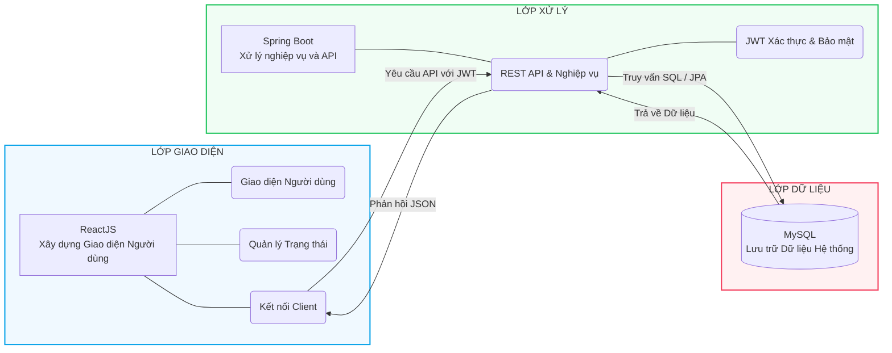

# Kiến trúc hệ thống - Personal Time Manager

Tài liệu này mô tả tổng quan về kiến trúc phần mềm và luồng hoạt động tổng thể của ứng dụng **Personal Time Manager**. Kiến trúc được chia thành 3 lớp (layer) rõ rệt: Lớp Giao diện, Lớp Xử lý và Lớp Dữ liệu.

---

## 1. LỚP GIAO DIỆN (FRONTEND)
Lớp này được xây dựng bằng **ReactJS**, chịu trách nhiệm trực tiếp giao tiếp với người dùng và hiển thị thông tin.

- **Giao diện Người dùng (UI):** Xây dựng các trang màn hình (Dashboard, Habit Tracker, Pomodoro, Calendar) bằng React Components và Tailwind CSS.
- **Quản lý Trạng thái (State Management):** Sử dụng React Hooks (`useState`, `useEffect`) và Context API để lưu trữ trạng thái cục bộ và toàn cục (ví dụ: giao diện sáng/tối, trạng thái đăng nhập).
- **Kết nối Client (API Client):** Sử dụng thư viện **Axios** để đóng gói và gửi các HTTP Request (GET, POST, PUT, DELETE) kèm theo JWT Token xuống tầng Backend.

---

## 2. LỚP XỬ LÝ (BACKEND & APIs)
Lớp trung tâm được xây dựng bằng **Spring Boot**, đóng vai trò là "bộ não" của hệ thống, tiếp nhận yêu cầu từ Frontend, xử lý nghiệp vụ và giao tiếp với cơ sở dữ liệu.

- **REST API & Nghiệp vụ:**
  - Cung cấp các Endpoints (đường dẫn API) để Frontend gọi dữ liệu.
  - Xử lý các logic nghiệp vụ phức tạp: tính toán ngày tháng cho Habit Tracker, thống kê dữ liệu báo cáo, lọc danh sách công việc.
- **Xác thực & Bảo mật (JWT):**
  - Tích hợp **Spring Security**.
  - Kiểm tra tính hợp lệ của JWT Token trong mỗi yêu cầu.
  - Phân quyền và cách ly dữ liệu: Đảm bảo người dùng chỉ xem và thao tác được trên dữ liệu cá nhân của chính họ.
  - Xử lý đăng nhập thông thường (Email/Mật khẩu) và đăng nhập qua bên thứ ba (Google OAuth2).

---

## 3. LỚP DỮ LIỆU (DATABASE & CACHING)
Lớp lưu trữ vật lý của ứng dụng, đảm bảo tính toàn vẹn và an toàn cho dữ liệu.

- **Lưu trữ Dữ liệu Hệ thống (MySQL):**
  - Hệ quản trị CSDL Quan hệ (RDBMS) dùng để lưu trữ toàn bộ thông tin về Người dùng, Công việc, Thói quen, Danh mục, v.v.
  - Giao tiếp với lớp Backend thông qua Spring Data JPA (Hibernate), giúp ánh xạ trực tiếp các bảng trong CSDL thành các đối tượng Java (Entities).

---

## 4. SƠ ĐỒ KIẾN TRÚC TỔNG QUAN

Dưới đây là sơ đồ mô tả luồng giao tiếp giữa 3 lớp trong hệ thống thực tế của Personal Time Manager:

