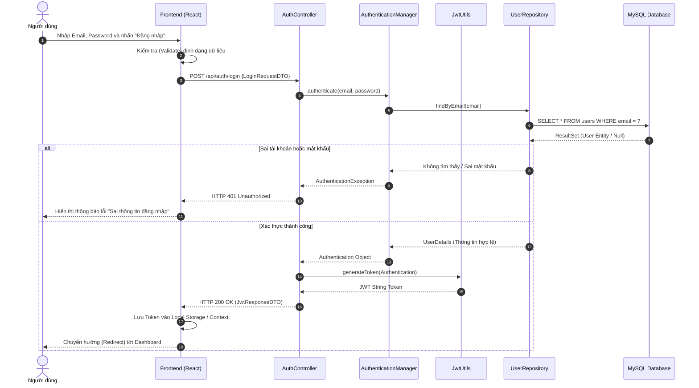
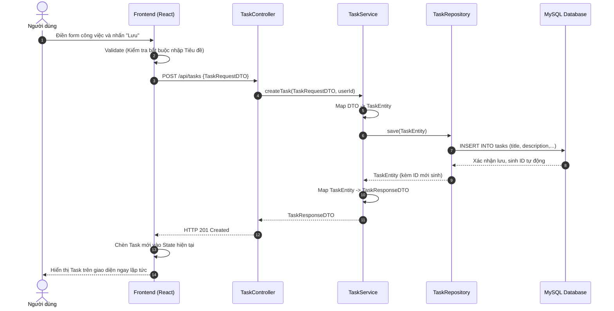
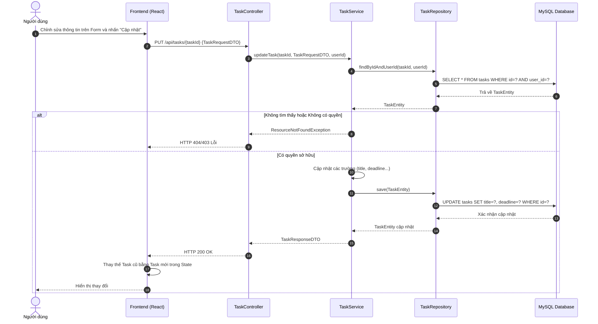
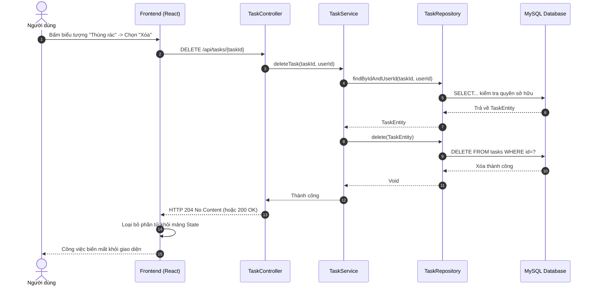
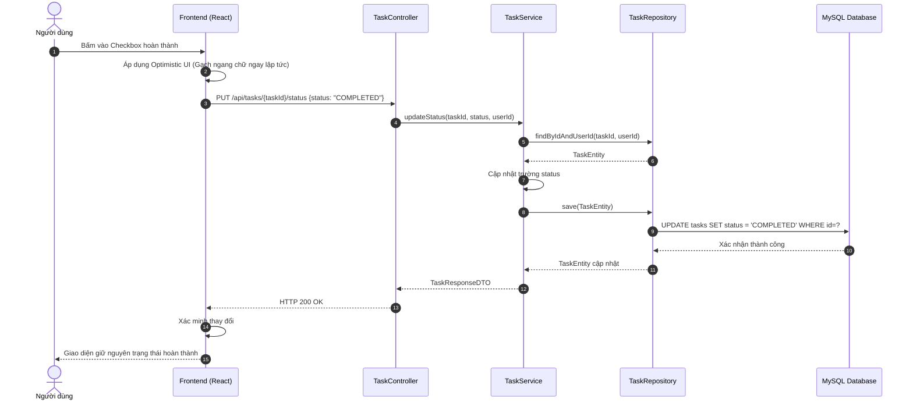
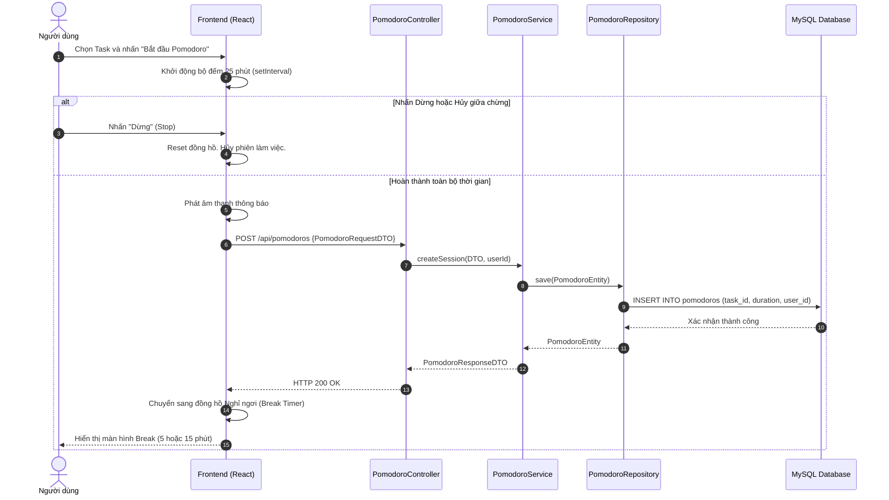
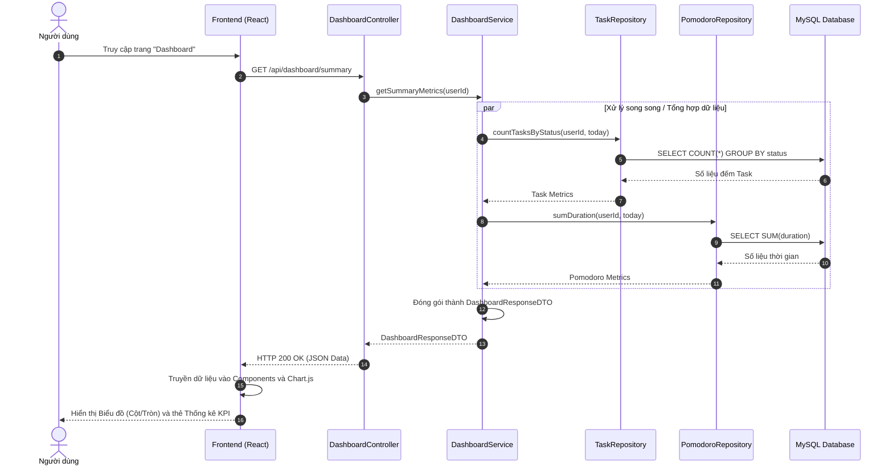
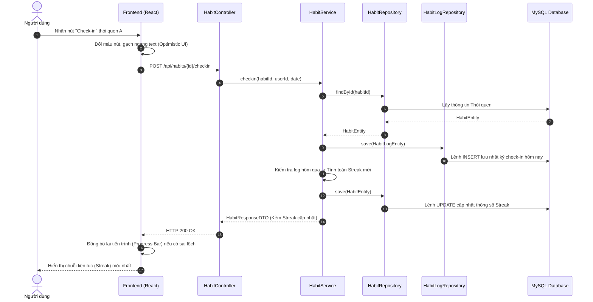

# Biểu Đồ Tuần Tự (Sequence Diagrams)

Tài liệu này cung cấp các biểu đồ tuần tự (Sequence Diagrams) chi tiết nhất cho 5 luồng chức năng cốt lõi của hệ thống **Personal Time Manager**.
Mỗi biểu đồ thể hiện luồng dữ liệu đi qua các tầng kiến trúc: **Client (React)** -> **Controller** -> **Service** -> **Repository** -> **Database**. Kèm theo đó là bảng đặc tả chi tiết giải thích luồng hoạt động từng bước. Tài liệu này đặc biệt quan trọng để đưa vào phần Thiết kế chi tiết trong báo cáo đồ án tốt nghiệp.

---

## 1. Biểu đồ Tuần tự: Chức năng Đăng nhập (Login)

### 1.1. Sơ đồ

### 1.2. Giải thích chi tiết
1. **Bước 1-2:** Người dùng nhập thông tin. Frontend tự động kiểm tra xem email có đúng định dạng không, mật khẩu có bị trống không trước khi gửi request để giảm tải cho server.
2. **Bước 3:** Frontend gửi yêu cầu HTTP POST chứa JSON body (`LoginRequestDTO`) tới `AuthController`.
3. **Bước 4-7:** Controller sử dụng `AuthenticationManager` của cấu trúc Spring Security để xác thực. Module này gọi xuống `UserRepository` để tìm user theo email trong Database.
4. **Bước 8 (Luồng ngoại lệ):** Nếu thông tin sai, Spring Security ném ra ngoại lệ. Controller bắt lỗi và trả về mã lỗi 401. Frontend báo lỗi hiển thị lên màn hình.
5. **Bước 9 (Luồng chính):** Nếu đúng, `AuthenticationManager` trả về đối tượng xác thực thành công.
6. **Bước 10-14:** `AuthController` sử dụng `JwtUtils` để tạo chuỗi mã hóa JWT dựa trên thông tin User. Trả chuỗi JWT về cho Frontend (kèm mã 200 OK). Frontend lưu Token này và cho phép người dùng đăng nhập vào hệ thống.

---

## 2. Biểu đồ Tuần tự: Phân hệ Quản lý Công việc (Task Management)

Phân hệ Quản lý công việc bao gồm các thao tác cốt lõi: Thêm (Create), Sửa (Update), Xóa (Delete) và Cập nhật trạng thái hoàn thành (Toggle Status).

### 2.1. Chức năng Thêm Công Việc Mới (Create Task)

**Sơ đồ:**

**Giải thích chi tiết:**
1. **Bước 1-2:** Người dùng điền Form. React kiểm tra tính hợp lệ dữ liệu.
2. **Bước 3-4:** Gửi POST request. Controller trích xuất `userId` (từ JWT Filter) và gọi `TaskService`.
3. **Bước 5-9:** DTO được map sang Entity. Repository gọi lệnh `INSERT` lưu vào CSDL và lấy về ID tự động.
4. **Bước 10-14:** Service map kết quả trả về `TaskResponseDTO`. Frontend nhận HTTP 201 và cập nhật danh sách ngay trên giao diện.

### 2.2. Chức năng Chỉnh Sửa Công Việc (Update Task)

**Sơ đồ:**

**Giải thích chi tiết:**
1. **Bước 1-3:** Khi lưu chỉnh sửa, gửi `PUT` lên server cùng `taskId`.
2. **Bước 4-7:** Rất quan trọng, Service phải tìm Task theo `taskId` VÀ `userId` để đảm bảo user không được sửa task của người khác.
3. **Bước 8-9 (Ngoại lệ):** Báo lỗi nếu không có quyền.
4. **Bước 10-17:** Nếu đúng quyền, thay đổi thuộc tính Entity, gọi `save()` tạo lệnh `UPDATE`, trả kết quả mới nhất cho Frontend để thay thế dữ liệu hiển thị.

### 2.3. Chức năng Xóa Công Việc (Delete Task)

**Sơ đồ:**

**Giải thích chi tiết:**
1. **Bước 1-2:** Gọi `DELETE` API kèm theo `taskId`.
2. **Bước 3-7:** Tương tự như sửa, hệ thống bắt buộc kiểm tra xem Task này có thuộc về người dùng đang thực hiện không.
3. **Bước 8-14:** Tiến hành lệnh `DELETE` xuống cơ sở dữ liệu. Nhận mã phản hồi (VD: 204), Frontend tiến hành dùng hàm `filter()` trên mảng để gỡ công việc đó ra khỏi màn hình.

### 2.4. Chức năng Cập nhật Trạng thái (Toggle Status)

**Sơ đồ:**

**Giải thích chi tiết:**
1. **Bước 1-2:** Giao diện phản ứng ngay lập tức bằng cách gạch ngang chữ công việc mà không cần chờ API. Đây là kỹ thuật Optimistic UI giúp tăng trải nghiệm người dùng.
2. **Bước 3-14:** Frontend gọi ngầm API `PUT .../status`. Backend tìm task, chuyển đổi trạng thái (COMPLETED hoặc PENDING) và lưu lại (UPDATE) vào Database, sau đó trả về cấu trúc DTO đã thay đổi để Frontend đối chiếu.

---

## 3. Biểu đồ Tuần tự: Sử dụng Đồng hồ Pomodoro (Pomodoro Timer)

### 3.1. Sơ đồ

### 3.2. Giải thích chi tiết
Luồng này đặc biệt ở chỗ hầu hết logic đếm thời gian được thực thi ở phía Client (React) nhằm tránh tạo tải ảo cho máy chủ.
1. **Bước 1-2:** React chịu trách nhiệm đếm ngược thời gian dựa trên hàm `setInterval`.
2. **Bước 3-4 (Luồng hủy):** Nếu người dùng nhấn dừng, React chỉ việc clear bộ đếm, không có yêu cầu API nào gửi lên server. Phiên làm việc coi như không tính.
3. **Bước 5-13 (Luồng hoàn thành):** Nếu đếm hết 25 phút, React tự động gửi request `POST` lên Backend báo cáo thành tích (gửi theo ID của task và thời lượng). Backend chỉ làm nhiệm vụ lưu lại lịch sử vào Database để sau này tính toán báo cáo. 
4. **Bước 14-15:** Khi Backend phản hồi lưu xong (200 OK), React tự động chuyển giao diện sang đếm giờ nghỉ ngơi.

---

## 4. Biểu đồ Tuần tự: Xem Dashboard / Báo cáo Thống kê

### 4.1. Sơ đồ

### 4.2. Giải thích chi tiết
Luồng này cho thấy mẫu thiết kế "API Gateway / Aggregator" ở Backend, gom nhiều nguồn dữ liệu vào một API duy nhất để tối ưu hiệu suất cho Frontend.
1. **Bước 1-3:** Khi vào trang chủ, thay vì Frontend phải gọi nhiều API lẻ tẻ, nó gọi duy nhất một API tổng hợp `GET /api/dashboard/summary`.
2. **Bước 4-11 (Xử lý đồng thời):** Trong `DashboardService`, hệ thống gọi xuống nhiều Repository khác nhau. Database thực thi các lệnh tính toán hàm tập hợp (`COUNT`, `SUM`) để lấy ra: Tổng số việc hôm nay, Số việc hoàn thành, Tổng thời gian học tập/làm việc.
3. **Bước 12-16:** Service gộp tất cả số liệu thô này vào một đối tượng duy nhất (`DashboardResponseDTO`) và trả về dưới dạng JSON. Frontend dùng dữ liệu JSON đó cung cấp cho thư viện `Chart.js` để render biểu đồ cực kỳ nhanh chóng.

---

## 5. Biểu đồ Tuần tự: Đánh dấu Thói quen (Check-in Habit)

### 5.1. Sơ đồ

### 5.2. Giải thích chi tiết
Luồng này thể hiện một kỹ thuật UX rất tốt ở Frontend và Logic xử lý dữ liệu chặt chẽ ở Backend.
1. **Bước 1-2:** Ngay khi nhấn Check-in, Frontend áp dụng kỹ thuật "Optimistic UI Update" (cập nhật giao diện lập tức giả định hệ thống xử lý thành công) để tạo cảm giác mượt mà, không có độ trễ cho người dùng.
2. **Bước 3-4:** Lệnh gọi API được đẩy chạy ngầm. Service nhận được request.
3. **Bước 5-12:** Service làm 2 việc quan trọng với Database:
    - Lưu một đối tượng `HabitLog` vào bảng Log để đánh dấu ngày hôm nay người dùng đã check-in.
    - Truy vấn lại để xem ngày hôm qua người dùng có thực hiện thói quen không. Nếu có, tăng Streak (chuỗi ngày liên tục) lên 1 đơn vị. Nếu không, đặt lại Streak về mức 1. Sau đó lưu cập nhật lại đối tượng `HabitEntity` chính.
4. **Bước 13-16:** Trả kết quả (Streak thực tế sau khi tính toán) về cho Frontend. Frontend xác nhận lại dữ liệu và đồng bộ UI (ví dụ làm đầy thanh tiến trình, nhảy số đếm Streak cho chính xác).
