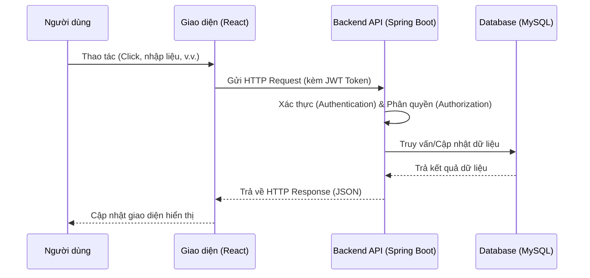
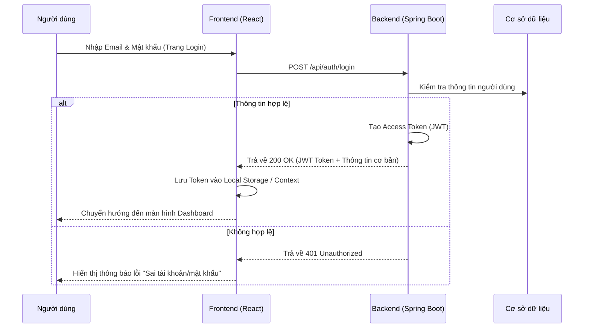
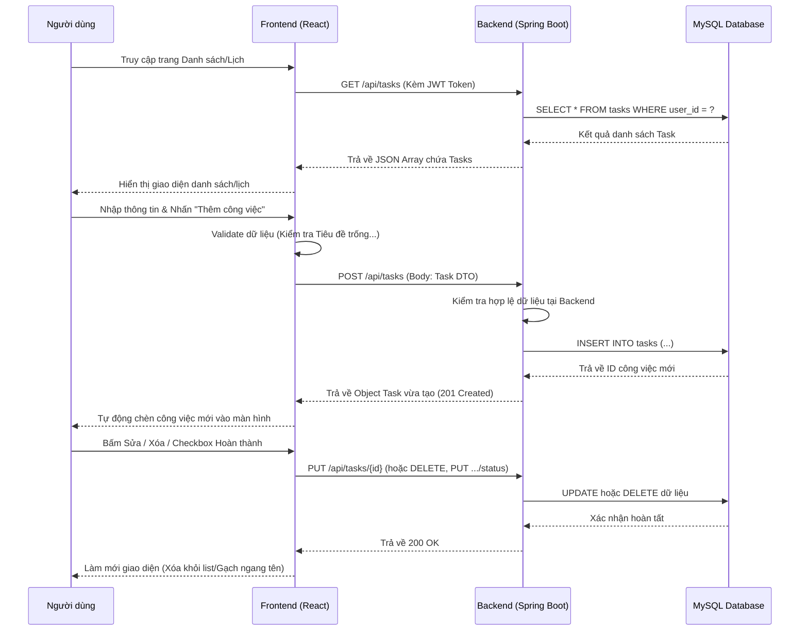

# Luồng Hoạt Động (Workflows) Hệ Thống Personal Time Manager

Tài liệu này mô tả tổng quan luồng hoạt động của hệ thống Personal Time Manager, bao gồm kiến trúc chung và các luồng chức năng (functional workflows) chính. Tài liệu này rất hữu ích để đính kèm vào báo cáo đồ án tốt nghiệp.

## 1. Kiến trúc Tổng quan (High-level Architecture)

Hệ thống được thiết kế theo mô hình Client-Server:
- **Client (Frontend):** Ứng dụng Single Page Application (SPA) xây dựng bằng React.js (Vite), tương tác với người dùng.
- **Server (Backend):** Cung cấp các RESTful APIs được xây dựng bằng Spring Boot (Java), xử lý logic nghiệp vụ và giao tiếp với cơ sở dữ liệu.
- **Database:** CSDL Quan hệ MySQL, dùng để lưu trữ dữ liệu người dùng, công việc, thói quen, và phiên làm việc Pomodoro.



## 2. Các Luồng Chức Năng Chính (Main Functional Workflows)

### 2.1. Luồng Xác Thực và Phân Quyền (Authentication & Authorization)
Bảo vệ tài nguyên hệ thống, đảm bảo mỗi người dùng chỉ truy cập được dữ liệu của mình.



### 2.2. Luồng Quản Lý Công Việc (Task Management Workflow)
Luồng này chịu trách nhiệm cho các thao tác CRUD (Tạo, Đọc, Sửa, Xóa) trên đối tượng Công việc (Task).



**Mô tả chi tiết các tiến trình:**
- **Khởi tạo trang (View/Read):** Khi người dùng vào trang `TaskList` hoặc `CalendarView`, Frontend tự động gọi API `GET /api/tasks`. (Riêng trang Lịch sẽ gửi thêm tham số `start_date` và `end_date` để lọc công việc theo tháng hiện tại).
- **Thêm mới (Create):** Dữ liệu nhập từ Form được Frontend kiểm tra sơ bộ (chặn lỗi bỏ trống tiêu đề), sau đó gửi `POST /api/tasks`. Backend nhận Request, lưu DB, và trả về bản ghi mới để Frontend thêm vào State, làm giao diện cập nhật ngay lập tức mà không bị chớp trang (reload).
- **Cập nhật nội dung (Update):** Khi bấm sửa, hệ thống mở Form chứa dữ liệu cũ. Sau khi thay đổi và lưu, gọi `PUT /api/tasks/{id}`.
- **Xóa (Delete):** Người dùng bấm xóa, hiển thị hộp thoại xác nhận. Nếu đồng ý, gọi `DELETE /api/tasks/{id}` và loại bỏ công việc đó khỏi State của Frontend.
- **Chuyển đổi trạng thái (Toggle Status):** Click trực tiếp vào Checkbox hoàn thành, Frontend lập tức gạch ngang chữ và làm mờ (Optimistic UI Update), đồng thời chạy ngầm API `PUT /api/tasks/{id}/status` lên Backend để đồng bộ trạng thái `COMPLETED` hoặc `PENDING`.

### 2.3. Luồng Theo Dõi Thói Quen (Habit Tracking Workflow)
Giúp người dùng xây dựng và duy trì các thói quen tốt hằng ngày.

```mermaid
flowchart TD
    A[Người dùng truy cập Habit Tracker] --> B{Đã có thói quen?}
    B -- Không --> C[Tạo thói quen mới]
    C --> D[Lưu vào Database]
    B -- Có --> E[Hiển thị danh sách thói quen]
    E --> F[Người dùng 'Check-in' thói quen trong ngày]
    F --> G[Cập nhật chuỗi (Streak) & Tiến độ]
    G --> H[Lưu log thói quen vào Database]
    H --> I[Cập nhật lại UI: Thanh Progress, Streak Count]
```

### 2.4. Luồng Kỹ Thuật Pomodoro (Pomodoro Timer Workflow)
Hỗ trợ quản lý thời gian tập trung làm việc/học tập và liên kết trực tiếp với công việc (task).

1. **Khởi tạo:** Người dùng truy cập `PomodoroPage` và chọn một công việc (task) cần tập trung thực hiện.
2. **Đếm ngược:** Người dùng bấm "Start". Frontend bắt đầu bộ đếm ngược (thường là 25 phút làm việc).
3. **Hoàn thành phiên:** Khi hết thời gian, Frontend hiển thị thông báo (Notification/Âm thanh).
4. **Lưu dữ liệu:** Frontend tự động gọi API `POST /api/pomodoros` để lưu phiên làm việc (lưu thời lượng, ID của task).
5. **Nghỉ ngơi:** Hệ thống tự động chuyển sang khoảng thời gian nghỉ ngơi (Short Break - 5 phút hoặc Long Break - 15 phút) trước khi bắt đầu vòng mới.

### 2.5. Luồng Báo Cáo & Thống Kê (Dashboard & Reporting Workflow)
Hệ thống tính toán và hiển thị các số liệu thống kê để người dùng theo dõi sự tiến bộ và năng suất.

- **Màn hình chính (Dashboard):** Khi load trang `Dashboard`, Frontend gửi request đến `DashboardController` để lấy các thẻ thông tin tổng quan (KPIs): Tổng số công việc trong ngày, số công việc đã hoàn thành, tổng thời gian đã dùng cho Pomodoro.
- **Báo cáo chi tiết (ReportPage):** Người dùng có thể phân tích thời gian làm việc theo tuần/tháng. Frontend gọi `GET /api/reports/pomodoro?period=week`. Backend nhóm dữ liệu (thực hiện truy vấn GROUP BY theo ngày/tuần) và gửi về mảng số liệu. Frontend dùng `Chart.js` để render các biểu đồ Cột/Tròn sinh động trực quan.

---
*Tài liệu này được sinh ra nhằm mục đích hỗ trợ quá trình phát triển dự án và làm tư liệu cho báo cáo đồ án tốt nghiệp môn học.*
