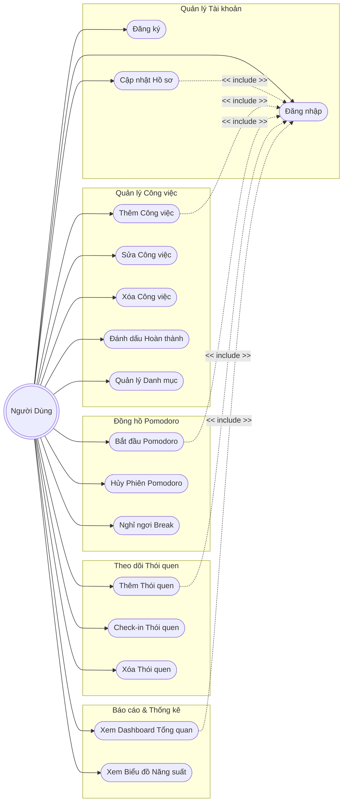

# Biểu Đồ Use Case & Đặc Tả Yêu Cầu (Phân Rã Chi Tiết)

Tài liệu này cung cấp sơ đồ Use Case và các đặc tả chi tiết cho hệ thống **Personal Time Manager**. Dựa trên yêu cầu thực tế, hệ thống tập trung phục vụ một đối tượng duy nhất, do đó chỉ có một tác nhân (Actor) là **Người Dùng**. Các chức năng lớn đã được phân rã (decompose) thành các Use Case nhỏ và cụ thể hơn.

## 1. Biểu đồ Use Case Phân rã (Decomposed Use Case Diagram)

Sơ đồ dưới đây mô tả chi tiết các hành động mà Người Dùng có thể thực hiện, được gom nhóm theo các phân hệ (modules) của hệ thống.

## 2. Đặc Tả Use Case Chi Tiết (Phân Rã)

Dưới đây là đặc tả chi tiết cho một số Use Case cốt lõi sau khi đã phân rã.

### 2.1. Nhóm Quản lý Công Việc (Chi tiết)

Đây là phân hệ cốt lõi của ứng dụng, cho phép người dùng toàn quyền kiểm soát các công việc cần làm. Nó bao gồm nhiều Use Case con liên kết chặt chẽ với nhau:

**UC-04.1: Xem Danh sách Công việc (View Tasks)**
*   **Mô tả:** Hiển thị danh sách toàn bộ các công việc của người dùng, cho phép sắp xếp và lọc.
*   **Luồng sự kiện chính:**
    1. Người dùng chọn tab "Danh sách Công việc" hoặc "Lịch" (Calendar).
    2. Frontend gửi request `GET /api/tasks` lên Backend (có kèm JWT Token).
    3. Backend truy vấn CSDL, trả về danh sách các công việc thuộc về ID người dùng đang đăng nhập.
    4. Hệ thống hiển thị danh sách lên màn hình (phân loại theo Hôm nay, Sắp tới, Đã quá hạn) hoặc gắn lên biểu đồ Lịch (React Big Calendar).

**UC-04.2: Thêm Công việc Mới (Create Task)**
*   **Mô tả:** Cho phép người dùng tạo một công việc mới.
*   **Tiền điều kiện:** Đã đăng nhập.
*   **Luồng sự kiện chính:** 
    1. Tại màn hình Danh sách, người dùng nhấn nút "Thêm công việc" (Add Task).
    2. Hệ thống hiển thị Form nhập liệu bao gồm:
       - **Tiêu đề (Bắt buộc):** Tên công việc.
       - **Mô tả (Tùy chọn):** Chi tiết công việc.
       - **Hạn chót (Deadline):** Ngày giờ phải hoàn thành.
       - **Mức độ ưu tiên (Priority):** Cao, Trung bình, Thấp (hoặc theo Ma trận Eisenhower).
       - **Danh mục (Category):** Gắn thẻ phân loại (Học tập, Cá nhân, Công việc,...).
    3. Người dùng nhập thông tin và nhấn "Lưu".
    4. Frontend kiểm tra tính hợp lệ (Validation) trực tiếp trên trình duyệt.
    5. Gửi request `POST /api/tasks` đến Backend.
    6. Backend lưu trữ vào CSDL (MySQL) và trả về thông tin đối tượng công việc vừa tạo.
    7. Frontend tự động chèn công việc mới vào danh sách mà không cần tải lại toàn bộ trang (Cập nhật giao diện lập tức).
*   **Luồng ngoại lệ (Alternative Flow):** 
    - Nếu bỏ trống Tiêu đề: Frontend chặn request, bôi đỏ ô nhập liệu và hiển thị thông báo "Tiêu đề không được để trống".
    - Nếu chọn ngày Hạn chót ở quá khứ: Cảnh báo "Hạn chót không hợp lệ".

**UC-04.3: Chỉnh sửa Công việc (Update Task)**
*   **Mô tả:** Thay đổi thông tin của một công việc đã tạo.
*   **Luồng sự kiện chính:**
    1. Người dùng click vào icon "Chỉnh sửa" (Edit) bên cạnh một công việc.
    2. Hệ thống mở Modal/Form điền sẵn các thông tin cũ của công việc đó.
    3. Người dùng thay đổi thông tin (ví dụ: Đổi ngày hết hạn, sửa tiêu đề) và nhấn "Cập nhật".
    4. Hệ thống gửi `PUT /api/tasks/{id}`. Cập nhật vào DB và phản hồi lại kết quả.

**UC-04.4: Xóa Công việc (Delete Task)**
*   **Mô tả:** Xóa bỏ hoàn toàn một công việc khỏi hệ thống.
*   **Luồng sự kiện chính:**
    1. Người dùng click vào icon "Thùng rác" (Delete).
    2. Hệ thống hiển thị Popup xác nhận: "Bạn có chắc chắn muốn xóa công việc này không?".
    3. Người dùng chọn "Có, xóa nó".
    4. Hệ thống gửi `DELETE /api/tasks/{id}`. Xóa bản ghi trong CSDL và gỡ phần tử đó khỏi giao diện.
*   **Luồng ngoại lệ:** Nếu người dùng chọn "Hủy", hệ thống đóng Popup và không thực hiện hành động nào.

**UC-04.5: Đánh dấu Hoàn thành / Hủy Hoàn thành (Toggle Task Status)**
*   **Mô tả:** Cập nhật trạng thái tiến độ nhanh chóng.
*   **Luồng sự kiện chính:** 
    1. Người dùng click vào ô Checkbox (Trạng thái Chưa hoàn thành) bên cạnh công việc.
    2. Giao diện ngay lập tức cập nhật: Gạch ngang tên công việc, làm mờ văn bản.
    3. Hệ thống chạy ngầm request `PUT /api/tasks/{id}/status` với trạng thái `COMPLETED` để đồng bộ CSDL.
    4. Nếu người dùng uncheck (bỏ dấu tick), hệ thống làm ngược lại quá trình trên, chuyển trạng thái về `PENDING` (Đang chờ xử lý).

### 2.2. Nhóm Đồng hồ Pomodoro
**UC-09: Bắt đầu Pomodoro (Start Pomodoro)**
*   **Tác nhân:** Người dùng.
*   **Mô tả:** Khởi động bộ đếm thời gian tập trung 25 phút.
*   **Tiền điều kiện:** Đã đăng nhập.
*   **Luồng sự kiện chính:**
    1. Người dùng chọn 1 công việc (tùy chọn) và nhấn nút "Start".
    2. Đồng hồ đếm ngược từ 25:00 về 00:00.
    3. Khi kết thúc, hệ thống phát tiếng chuông, tự động gọi API lưu phiên làm việc này vào thống kê.

**UC-10: Hủy Phiên Pomodoro (Cancel Pomodoro)**
*   **Tác nhân:** Người dùng.
*   **Mô tả:** Dừng bộ đếm thời gian trước khi 25 phút kết thúc.
*   **Luồng sự kiện chính:** Người dùng nhấn "Stop" khi đồng hồ đang chạy. Hệ thống reset đồng hồ về 25:00 và **không** ghi nhận phiên làm việc này vào lịch sử.

### 2.3. Nhóm Theo dõi Thói quen
**UC-13: Check-in Thói quen (Check-in Habit)**
*   **Tác nhân:** Người dùng.
*   **Mô tả:** Đánh dấu đã hoàn thành thói quen trong ngày để tăng chuỗi duy trì (Streak).
*   **Tiền điều kiện:** Đã tạo ít nhất 1 thói quen.
*   **Luồng sự kiện chính:** 
    1. Người dùng bấm nút "Check-in" trên thẻ thói quen của ngày hôm nay.
    2. Hệ thống lưu lịch sử (log) ngày hôm nay.
    3. Hệ thống kiểm tra ngày hôm qua có check-in không. Nếu có, tăng Streak lên +1. Nếu không, reset Streak về 1.
    4. Cập nhật giao diện.

### 2.4. Nhóm Báo Cáo Thống Kê
**UC-16: Xem Biểu đồ Năng suất (View Productivity Charts)**
*   **Tác nhân:** Người dùng.
*   **Mô tả:** Xem số liệu thống kê thời gian làm việc trực quan thông qua biểu đồ.
*   **Luồng sự kiện chính:** 
    1. Người dùng chuyển sang tab "Báo cáo".
    2. Người dùng chọn bộ lọc "Tuần này" hoặc "Tháng này".
    3. Backend truy xuất số liệu tổng hợp các phiên Pomodoro đã hoàn thành theo từng ngày.
    4. Frontend vẽ biểu đồ cột thể hiện thời gian tập trung mỗi ngày.
